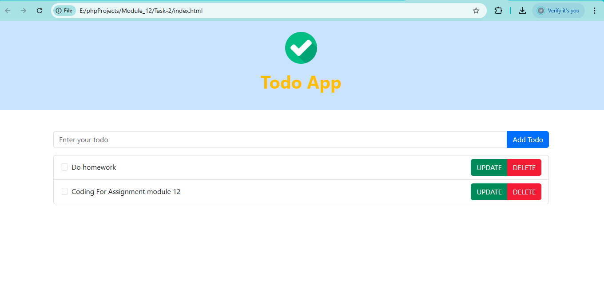

# ✅ Todo App — Task 2 (Module 12 Assignment)

A feature-rich **Todo List App** built with **HTML**, **Bootstrap**, and **JavaScript**, including localStorage support and full CRUD operations.

📂 **GitHub Repository**: [https://github.com/tonmoysohaib/Module_12_Assignment](https://github.com/tonmoysohaib/Module_12_Assignment)

---

## 🎯 Features

- ✅ **Add Todo**: Enter task name and click "Add Todo"
- ✅ **Save in Browser**: Uses `localStorage` to persist tasks even after reload
- ✅ **Display on Load**: Loads saved todos on page load
- ✅ **Mark as Completed**: Checkbox strikes through completed tasks
- ✅ **Edit (Update)**: Inline edit with a "SAVE" button
- ✅ **Delete**: Remove a task with "DELETE" button
- ✅ **Responsive** using Bootstrap 5

---

## 🧠 Technologies Used

- HTML5
- Bootstrap 5 (CDN)
- JavaScript ES6
- localStorage (Web API)

---

## 🧩 File Structure

Module_12_Assignment/
├── task2/
│ ├── index.html
│ ├── script.js
│ └── README.md

📸 Screenshot

🧑‍💻 Author
Tonmoy Sohaib
GitHub: @tonmoysohaib