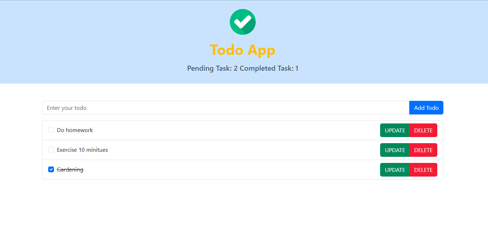

# 📝 Todo App

A simple and interactive **Todo List Application** built with **HTML**, **Bootstrap 5**, and **JavaScript**.

---

## 🔥 Features

- Add new tasks with a text input
- Mark tasks as completed/uncompleted with a checkbox
- Edit existing tasks inline
- Delete tasks
- View live count of **Pending** and **Completed** tasks
- Data persistence using **localStorage** (tasks saved even after page refresh)

---

## 💻 Technologies Used

- HTML5
- Bootstrap 5 (via CDN for styling)
- JavaScript (DOM manipulation, events, localStorage)

---

## 📁 Project Structure

Task-2/
├── index.html # Main HTML file
├── script.js # JavaScript for todo functionality
└── README.md # This file

---

## 🚀 How to Run

1. Clone the repository or download the project folder.
2. Open `index.html` in any modern browser.
3. Start adding, editing, completing, and deleting your todos!

---

## 📸 Screenshot



---

## 🎥 Demo Video

Watch the demo video here:  
[Google Drive Demo](https://drive.google.com/drive/folders/16Minu21W8m_vQVL131f18k_ZS5rM_DWg)

---

## 👨‍💻 Author

**Tonmoy Sohaib**  
GitHub: [https://github.com/tonmoysohaib](https://github.com/tonmoysohaib)

---

## 📝 Code Snippet Example

Here’s a glimpse of the core JavaScript logic that handles rendering and updating todos:

```js
let todos = [];

function renderTodos() {
  const list = document.getElementById("todo-list");
  list.innerHTML = "";

  let pendingCount = todos.filter(todo => !todo.completed).length;
  let completedCount = todos.filter(todo => todo.completed).length;
  document.getElementById("pending-count").textContent = pendingCount;
  document.getElementById("completed-count").textContent = completedCount;

  todos.forEach((todo, index) => {
    // Create list item, checkbox, buttons, and add event listeners...
  });
}
